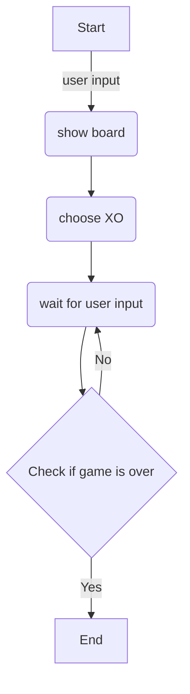

```mermaid
flowchart TD
    A[Start] -->|user input| B1(show board)
    B1(show board)-->B2(choose XO)
    B2-->B(wait for user input)
    B --> C{Check if game is over}
    C -->|Yes| D[End]
    C -->|No| B
```
